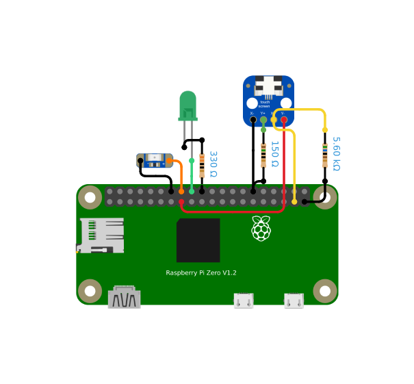

# PiSight

This is an adaptation of [Webcam Pi](https://www.github.com/elcalzado/webcampi) intended to be used alongside some components from the Apple iSight webcam. It specifically targets the original **Raspberry Pi Zero** and offloads all video compression to the Pi's **hardware JPEG encoder**, so the tiny single-core board can stream 720p/1080p smoothly. If you're interested in building this, follow this documentation and my YouTube video!

[](https://www.youtube.com/watch?v=s-X41YuiVAM)

## Table of Contents

1. [Required Hardware](#required-hardware)
2. [Features](#features)
3. [Installation](#installation)
4. [Setup](#setup)
5. [Configuration](#configuration)
6. [Building](#building)
7. [Credits](#credits)

## Required Hardware

| Part                         | Description                         | Buy / Download                                            |
| ---------------------------- | ----------------------------------- | --------------------------------------------------------- |
| Apple iSight                 | The shell for the camera            | [eBay](https://www.ebay.com/sch/i.html?_nkw=apple+isight) |
| Raspberry Pi Zero (v1.3)     | Main compute module (BCM2835/ARMv6) | [Raspberry Pi](https://www.raspberrypi.com/products/raspberry-pi-zero/) |
| Camera Module 3              | CSI-2 camera module                 | [Adafruit](https://www.adafruit.com/product/5657)         |
| microSD card (≥100 MB)       | System storage                      | [Amazon](https://a.co/d/8l5QlQr)                          |
| USB-C cable                  | USB-OTG data & power                | [Amazon](https://a.co/d/9c4WzDl)                          |
| USB-C female breakout board  | Replaces original micro‑USB port    | [Amazon](https://a.co/d/h6eIS50)                          |
| Touchscreen breakout board   | Shutter (IR sensor) adapter         | [Adafruit](https://www.adafruit.com/product/334)          |
| Resistors (330)   | Activity/logo LEDs | [Amazon](https://a.co/d/awGgQPf)                         |
| Resistors (5.6k, 150)   | Shutter sensor | [Amazon](https://a.co/d/071cmTeQ)                         |
| Adafruit Sequin LED          | Optional Apple logo back‑light      | [Adafruit](https://www.adafruit.com/product/1758)         |
| Any soldering iron           | Wire soldering needed               | [Amazon](https://www.amazon.com/s?k=soldering+iron)       |
| Any drill with a 5/64 in bit | For swivel slot hole                | [Amazon](https://www.amazon.com/s?k=drill)                |
| 3D printed parts             | Internal frame + mounting adapters  | [Printables](https://www.printables.com/model/1427221-pisight)                                            |

## Features

PiSight keeps all the core functionality of Webcam Pi while adding hardware integration and quality‑of‑life features specific to the Apple iSight enclosure.

### Video pipeline

- **Hardware MJPEG encoding on the Pi Zero.** The original Pi Zero's single ARMv6 core cannot compress HD video in software, so PiSight hands raw camera frames to the Pi's VideoCore **hardware JPEG encoder** (`bcm2835-codec`) **zero‑copy over DMA‑BUF**, straight from the camera ISP. The CPU never touches pixel data, keeping the board responsive while it streams 720p/1080p MJPEG.
- **Adjustable JPEG quality, resolution, and field of view** from a plain‑text config file on the SD card — no rebuild required. See [Configuration](#configuration).
- **Enumerates as an Apple “iSight”** (manufacturer *Apple Computer, Inc.*), so the host sees it as a genuine iSight camera.

### iSight enclosure integration

- Apple iSight enclosure compatibility
- Lets you retain the original iSight’s tilt and axial twist
- Reused original activity LED
- Optional rear Apple logo illumination (configurable: `off` / `on` / `activity`)
- Integrated IR shutter / privacy sensor
	- For more info about how the sensor works check out: [isight-shutter](https://github.com/elcalzado/isight-shutter)
- USB‑C breakout replaces the original connector area

## Installation

1. Download the latest image from the [Releases](https://github.com/sd-zhang/pisight/releases) page.
2. Insert your microSD card into your host computer.
3. Flash the image:
	- Linux/macOS:
   ```bash
   # Replace /dev/sdX with your card device
   sudo dd if=pisight-<version>.img of=/dev/sdX
   ```
	- Windows:
   ```
   Use a tool like Balena Etcher or Raspberry Pi Imager
   ```

## Setup



1. Insert the flashed microSD card into the Pi.
2. Assemble the camera (YouTube at the top video shows how I did it).
3. Plug an USB-C cable into the camera and the other end into your host USB port.
4. On your host machine, a new video device should appear.

## Configuration

PiSight reads its settings at boot from **`isight.json` on the FAT boot partition** — the same volume your Mac or PC mounts when you plug in the SD card. Edit the file, save, eject, and reboot; there is no web UI or login. The file is created with defaults on first boot, and if it is missing or invalid PiSight falls back to safe built‑in values and still boots.

Default `isight.json`:

```json
{
  "resolutions": ["1280x720", "1920x1080"],
  "fov": 75,
  "logo_light": "activity",
  "quality": 72
}
```

| Key           | Values                    | Default                    | Description |
| ------------- | ------------------------- | -------------------------- | ----------- |
| `resolutions` | list of `"WxH"`           | `["1280x720","1920x1080"]` | The MJPEG modes advertised to the host over USB. The host can only pick from this list; the first entry is the default mode. |
| `fov`         | integer degrees           | `75`                       | Field of view. The full sensor is ~75°; a smaller value crops the centre via the ISP for an optical‑style zoom at no CPU cost. `75` or higher keeps the full frame. |
| `quality`     | `1`–`100`                 | `72`                       | JPEG quality handed to the hardware encoder. Higher means better image and larger frames. |
| `logo_light`  | `off` / `on` / `activity` | `activity`                 | Rear Apple‑logo LED (GPIO 23). `activity` mirrors the streaming indicator; `on`/`off` hold it steady. |

## Building

### Prerequisites

- Linux host (WSL is fine)
- Git and buildroot dependencies

### Clone

```bash
git clone --recursive https://github.com/sd-zhang/pisight.git
cd pisight
```

### Build

```bash
# This will configure Buildroot and compile the kernel, rootfs, and image
./build.sh
```

When complete, the final SD card image will be in:

```
buildroot/output/images/sdcard.img
```

Flash it as described in [Installation](#installation).

## Credits

- [webcampi](https://github.com/elcalzado/webcampi): The embedded linux image from which pisight is derived.
- [original pisight](https://github.com/maxbbraun/pisight): The project that inspired this!
- [isight-shutter](https://github.com/elcalzado/isight-shutter): Brief documentation for the Apple iSight's shutter sensor.
