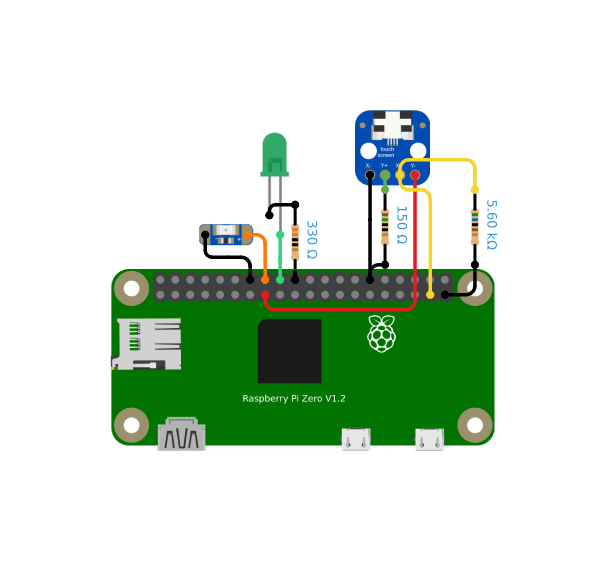

# PiSight

This is an adaptation of [Webcam Pi](https://www.github.com/elcalzado/webcampi) intended to be used alongside some components from the Apple iSight webcam. It specifically targets the original **Raspberry Pi Zero** and offloads all video compression to the Pi's **hardware JPEG encoder**, with simultaneous 720p video and microphone capture verified on hardware. If you're interested in building this, follow this documentation and my YouTube video!

[](https://www.youtube.com/watch?v=s-X41YuiVAM)

## Table of Contents

1. [Required Hardware](#required-hardware)
2. [Features](#features)
3. [Installation](#installation)
4. [Setup](#setup)
5. [Configuration](#configuration)
6. [Building](#building)
7. [Tested baseline](#tested-baseline)
8. [Credits](#credits)

## Required Hardware

| Part                         | Description                         | Buy / Download                                            |
| ---------------------------- | ----------------------------------- | --------------------------------------------------------- |
| Apple iSight                 | The shell for the camera            | [eBay](https://www.ebay.com/sch/i.html?_nkw=apple+isight) |
| Raspberry Pi Zero (v1.3)     | Main compute module (BCM2835/ARMv6) | [Raspberry Pi](https://www.raspberrypi.com/products/raspberry-pi-zero/) |
| Camera Module 3              | CSI-2 camera module                 | [Adafruit](https://www.adafruit.com/product/5657)         |
| microSD card (≥100 MB)       | System storage                      | [Amazon](https://a.co/d/8l5QlQr)                          |
| USB-C cable                  | USB-OTG data & power                | [Amazon](https://a.co/d/9c4WzDl)                          |
| USB-C female breakout board  | Replaces original micro‑USB port    | [Amazon](https://a.co/d/h6eIS50)                          |
| Touchscreen breakout board   | Shutter (IR sensor) adapter         | [Adafruit](https://www.adafruit.com/product/334)          |
| Resistors (330)   | Activity/logo LEDs | [Amazon](https://a.co/d/awGgQPf)                         |
| Resistors (5.6k, 150)   | Shutter sensor | [Amazon](https://a.co/d/071cmTeQ)                         |
| Adafruit Sequin LED          | Optional Apple logo back‑light      | [Adafruit](https://www.adafruit.com/product/1758)         |
| Any soldering iron           | Wire soldering needed               | [Amazon](https://www.amazon.com/s?k=soldering+iron)       |
| Any drill with a 5/64 in bit | For swivel slot hole                | [Amazon](https://www.amazon.com/s?k=drill)                |
| 3D printed parts             | Internal frame + mounting adapters  | [Printables](https://www.printables.com/model/1427221-pisight)                                            |

## Features

PiSight keeps all the core functionality of Webcam Pi while adding hardware integration and quality‑of‑life features specific to the Apple iSight enclosure.

### Video pipeline

- **Hardware MJPEG encoding on the Pi Zero.** The original Pi Zero's single ARMv6 core cannot compress HD video in software, so PiSight hands raw camera frames to the Pi's VideoCore **hardware JPEG encoder** (`bcm2835-codec`) **zero‑copy over DMA‑BUF**, straight from the camera ISP. Raw camera buffers pass through the ISP and encoder without a CPU-side pixel copy. USB handling, camera control, compressed-data handling and audio processing still use CPU.
- **Adjustable JPEG quality, resolution, field of view and exposure** through UVC controls and persistent settings. See [Configuration](#configuration).
- **USB camera named “iSight” and input named “iSight Microphone”.** The microphone retains that name when active or inactive.
- **Simultaneous camera and microphone:** mono 48 kHz I2S audio over UAC2, with live UVC gain, high-pass, low-pass and bypass controls ready for a future app.

### iSight enclosure integration

- Apple iSight enclosure compatibility
- Lets you retain the original iSight’s tilt and axial twist
- Reused original activity LED
- Optional rear Apple logo illumination (configurable: `off` / `on` / `activity`)
- Optional shutter soft switch: GPIO 26 edges disconnect/reconnect camera and mic together, without a polling worker. The sensor on the tested assembly appears broken or miswired; a physical shutter still works mechanically. See [isight-shutter](https://github.com/elcalzado/isight-shutter) for wiring.
- USB‑C breakout replaces the original connector area

## Installation

1. Build this branch, or use an image from [Releases](https://github.com/sd-zhang/pisight/releases). The accepted development image described below is local and has not been published as a release.
2. Insert your microSD card into your host computer.
3. Flash the image:
	- Linux/macOS:
   ```bash
   # Replace /dev/sdX with your card device
   sudo dd if=pisight-<version>.img of=/dev/sdX
   ```
	- Windows:
   ```
   Use a tool like Balena Etcher or Raspberry Pi Imager
   ```

## Setup



1. Insert the flashed microSD card into the Pi.
2. Assemble the camera (YouTube at the top video shows how I did it).
3. Plug an USB-C cable into the camera and the other end into your host USB port.
4. On your host machine, a new video device should appear.

## Configuration

PiSight reads its settings at boot from **`isight.json` on the FAT boot partition**. The file is created with defaults on first boot. After sealing the case, use the webcam's normal UVC controls for resolution, zoom/FOV and brightness/EV; use the PiSight extension control to save FOV, EV, logo mode and microphone presence. This uses the existing UVC control interface and adds no network or serial USB function.

Default `isight.json`:

```json
{
  "resolutions": ["1280x720", "1920x1080", "1280x960"],
  "fov": 75,
  "ev": 0,
  "logo_light": "activity",
  "quality": 72,
  "microphone": true,
  "audio": {"gain_db": 0, "highpass_hz": 80, "lowpass_hz": 8000, "bypass": false},
  "diagnostics": false
}
```

| Key           | Values                    | Default                    | Description |
| ------------- | ------------------------- | -------------------------- | ----------- |
| `resolutions` | list of `"WxH"`           | `["1280x720","1920x1080","1280x960"]` | The MJPEG modes advertised to the host over USB. The host can only pick from this list; the first entry is the default mode. `1280x960` provides 4:3 framing; the other defaults are 16:9. |
| `fov`         | integer degrees           | `75`                       | Approximate digital crop referenced to the camera's 75° diagonal 16:9 field of view. Leave at `75` to compare 16:9 and 4:3 framing; smaller values crop further via the ISP. The angle is not calibrated for 4:3. |
| `ev`          | `-2.0`–`2.0`              | `0`                        | Exposure compensation, in EV. The UVC Brightness control maps to tenths of an EV (`-20`–`20`). |
| `quality`     | `1`–`100`                 | `72`                       | JPEG quality handed to the hardware encoder. Higher means better image and larger frames. |
| `logo_light`  | `off` / `on` / `activity` | `activity`                 | Rear Apple‑logo LED (GPIO 23). `activity` mirrors the streaming indicator; `on`/`off` hold it steady. |
| `microphone`  | `true` / `false` | `true` | Expose the ICS43434 as a mono 48 kHz USB microphone. Set to `false` and reboot for camera-only USB mode. |
| `audio` | gain/filter/bypass object | 0 dB, 80 Hz–8 kHz, bypass off | Live UVC tuning; explicit Save persists it. See the [protocol](docs/uvc-audio-controls.md) for limits. |
| `diagnostics` | `true` / `false` | `false` | Enable bounded RAM snapshots for UVC readback. No periodic SD log copies. |

Existing `isight.json` files keep their own resolution list; add `"1280x960"` there to expose 4:3 after updating the image.

Firmware also supports live microphone gain, high-pass/low-pass cutoffs and bypass
through UVC, with explicit Save to `isight.json`. Diagnostics are off by default
(`"diagnostics": false`); enabled snapshots stay in RAM with a 4 MiB limit and
can be downloaded through UVC. Periodic diagnostics no longer write to the SD
card. These capabilities are ready for a future settings app; the existing
camera CLI does not expose them. See the [audio and diagnostics protocol](docs/uvc-audio-controls.md).

The host selects resolution and aspect ratio through the standard UVC MJPEG formats. UVC Zoom Absolute (`100`–`350`, where `100` is the uncropped view) changes FOV; UVC Brightness (`-20`–`20`) changes EV. These standard controls apply live and reset to the saved values on restart. The USB microphone exposes the normal UAC2 mute control when enabled.

On Linux, build the small host configurator with `cc -O2 -Wall host/pisightctl.c -lm -o pisightctl`. It discovers PiSight's extension unit by GUID and saves settings over UVC:

```bash
./pisightctl /dev/video0 get
./pisightctl /dev/video0 set --fov 54 --ev -0.3 --logo activity --mic on
```

FOV, EV and logo mode apply immediately; restart PiSight for microphone presence changes. The tool verifies the value returned by the camera after a save. A camera application's resolution selection remains independent of these saved settings. On other hosts, standard UVC video/audio controls still work; the bundled settings utility currently targets Linux.

The ICS43434 uses the Pi Zero's I²S pins: SCK/BCLK on GPIO 18 (pin 12), WS/LRCLK on GPIO 19 (pin 35), SD on GPIO 20 (pin 38), plus 3.3 V and ground. Connect the mic's L/R select to ground for the left channel. If the microphone does not appear, check `/tmp/pisight-mic.log` on the Pi and confirm the ALSA cards `PiSightMic` and `UAC2Gadget` are present.

Advertised resolution presets can also be configured through the future UVC app;
see [video modes and software restart](docs/uvc-video-modes.md). Applying a changed
advertised list uses a software reboot, with no cable handling. This newer firmware
capability has passed offline checks; it has not been confirmed on the sealed
unit, whose last confirmed installed image is the tested baseline below.

## Building

### Prerequisites

- x86-64 Linux host (the pinned external toolchain requires this architecture)
- Git and buildroot dependencies

### Clone

```bash
git clone --branch pizero-hw-mjpeg-encoder --recurse-submodules https://github.com/sd-zhang/pisight.git
cd pisight
```

### Build

```bash
# On an ARM Mac, use an x86-64 Linux build environment such as Docker Desktop.
./build.sh
```

When complete, the final SD card image will be in:

```
webcampi/buildroot/output/images/sdcard.img
```

See [development instructions](docs/development.md) for the verified Linux build setup, submodule workflow and image export checks. Flash the image as described in [Installation](#installation).

## Tested baseline

The accepted 2026-09-28 run delivered **29.96 distinct fps at 1280×720 with the
microphone open**, with six JPEG errors over roughly two minutes. Native 20- and
90-second combined captures had continuous 48 kHz audio timestamps. The 1080p
mode is advertised, but these results cover 720p.

Microphone processing used about 9% CPU with filtering, versus about 5% before
filtering. Total CPU was around 71–72% in mostly active measurement windows.
Live tuning and diagnostics toggling were tested; defaults were restored and
diagnostics left off. Acoustic latency and subjective voice quality remain
unmeasured. Bulk diagnostic downloads can temporarily reduce video FPS; the
camera recovered afterward without a lasting slowdown.

Local image: `diagnostics/sdcard-audio-settings.img` (41,431,552 bytes), SHA-256
`244a83b7ad1cad01d9df80f99996fda27e62de0b45a22f3fb88e0a0393186c39`.
Images and raw recordings are excluded from Git.

Read the [hardware report](diagnostics/capture-audio-settings-20260928/results.md),
[current engineering notes](DEBUGGING_NOTES.md), or the
[story of getting camera and mic working together](docs/the-road-to-simultaneous-av.md).

## Credits

- [webcampi](https://github.com/elcalzado/webcampi): The embedded linux image from which pisight is derived.
- [original pisight](https://github.com/maxbbraun/pisight): The project that inspired this!
- [isight-shutter](https://github.com/elcalzado/isight-shutter): Brief documentation for the Apple iSight's shutter sensor.
